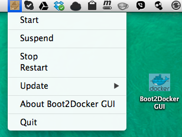

boot2docker GUI for Mac OS X
============================

boot2docker GUI for Mac OS X is a Mac Status bar App which works like a wrapper around the boot2docker command line tool.
[boot2docker](https://github.com/boot2docker/boot2docker) is a lightweight Linux distribution made specifically to run [Docker](https://www.docker.io/) containers.



Download
--------
Head over to the [Releases Page](https://github.com/rimusz/boot2docker-gui-osx/releases) to grab the latest ZIP file with the ````Install package````.


How to install
----------

Firstly it needs ````VirtualBox for OS X```` to be present on the OS X.
If you do not have it, download [VirtualBox for OS X hosts](https://www.virtualbox.org/wiki/Downloads) and install it.

Next, unzip the ````Boot2Docker GUI v0.3.0 Install.zip```` and just run the ````Boot2Docker GUI Install````.
It will install all [boot2docker](https://github.com/boot2docker/boot2docker) and [Docker](https://www.docker.io/) files
and will put to user's home folder: ````./boot2docker```` and ````bin```` folders.
Boot2Docker GUI App will be put onto your Desktop. You are free to copy it whatever you like.

How it works
------------

Just start ````Boot2Docker GUI```` application and you will find a small icon with the docker image in the Status Bar.

* There you can ````Start````, ````Suspend````, ````Restart````, ````Stop```` boot2docker OS VM
* ````Update```` boot2docker OS, boot2docker tool and docker OS X client


Extra functionality
-------------------

If you want an easy access to ````boot2docker OS VM file system```` e.g to put your files needed for your docker containers,
just install latest versions of ````OSXFUSE```` and ````SSHFS```` for OS X from [osxfuse.github.io](http://osxfuse.github.io/).
* On the ````Start```` new folder ````b2d-share```` will be created in your home directory (e.g. /Users/someuser), there the remote
boot2docker folder ````/mnt/sda1/b2d-share```` (which gets created automatically too) will be mounted.
You can create as many folders as you need on the shared folder.
* ````Suspend```` and ````Stop```` unmounts that folder automatically too.
* ````Restart```` re-mounts the shared folder.
It can be used till the ````boot2docker```` gets full NFS based shared folder implementation between the ````OS X```` and ````boot2docker OS````.


TO-DOs
------

* Add option to open ````.boot2docker```` folder from the menu
* Full/clean boot2docker and docker setup uninstall via menu
* Open at login


